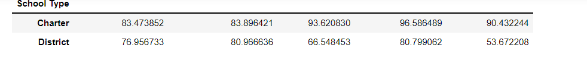

# School_District_Analysis

## Overview
In this analysis we focused on a reporting dataset for a school district. In our new analysis, we needed to remove a grade due to the data being miscollected. By analyzing our data, we were able to create reporting around the reading and math scores for thousands of students. Eventually, we created organized information around school types, school budgets, and school size.
  

## Results
* **How is the district summary affected?**
    The district summary change from the original (seen in "District Summary Original") was very minimal. As we see from the screenshot "District Summary New" we had to use our unformatted code in order to analyze the change, as it resulted in a small percentage change.  
    
    
      
    As we can see above, we are not able to see the change without providing the unformatted columns produced by our score averages and percentages passed. The reason that the change is so minimal is due to the size of ninth graders at Thomas High School. As we can see from the "Ninth Grade Results" snapshot code, our new sample size is 38709 resulting in a change of 461 removed scores, calculated by subtracting the ninth graders from Thomas High School, from the total students of 39170 calculated by the "Total Student Calculation Code".
    If we divide 38709/39170 we get 1.011% of students that were in the ninth grade at Thomas High School that were removed from the data set.

    
    

* **How is the school summary affected?**

    Because the scores of one school were updated, the school_summary_df will look very similar to the original code. Again, the percentage of students that changed from the total sample size is around 1.01% so the shift in data will not change that much, in the event of "Per School Summary New" we see that any values related to the scores of Thomas High School have all been updated. The other values, however will remain the same.

    

    
    

* **How does replacing the ninth graders’ math and reading scores affect Thomas High School’s performance relative to the other schools?**

    In this example i will be using the top 5 schools to compare Thomas High School, as seen in "Top Five Schools New", produced by the "Top Five Code Snapshot".

    Compared to the "Top Five Schools Old" we see that Thomas High School produced an overall passing percentage of 90.95 before the ninth-graders were removed. After, it produced an overall passing percentage of 90.63.

    
    

    In order to produce the overall passing percentage, we used the "Overall Passing Percentage" code. This calculation is very important in determining the performance of a school based on math and reading scores. As we can see from the snapshot, we take into account both the math and reading scores, along with the new student count total to make this calculation. 

    

* **How does replacing the ninth-grade scores affect the following:**
    * Math and reading scores by grade
        
        By comparing the original reading and math scores to the new reading and math scores the only change that we will see will come with the NaN value that we used by replacing the ninth-grade scores for THS. This was done in the "Null Value Code" snapshot.
        Because only the 9th grade class for THS was altered, we will only see that change in our new analysis. 
        

    * Scores by school spending

        As we can see from the snapshots below, the only spending bucket that changed was the spending bucket that THS fell into, $630-$644. The percentage varied by a very small percentage, likely due to only changing roughly 400 records.

         
          

       
    * Scores by school size

        As we can see from the snapshots below, the only size bucket that changed was the size  bucket that THS fell into, Medium (<1000 - 2000). The percentage varied by a very small percentage, likely due to only changing roughly 400 records. Also note that we would not see this change unless the data was unformatted.
         
          
    * Scores by school type
        
         As we can see from the snapshots below, the only type bucket that changed was the type  bucket that THS fell into, District. The percentage varied by a very small percentage, likely due to only changing roughly 400 records. Also note that we would not see this change unless the data was unformatted.

         
          

## Summary
### Code Change 1
The first code change was to 1st, pinpoint the location of the data we needed, and then to replace the data. This was done in the string "student_data_df.loc[(student_data_df["school_name"] == "Thomas High School") & (student_data_df["grade"] == "9th"), ["reading_score"]] = np.nan"

Here we see, that we are using the student_data_df (also known as the students_complete.csv), and looking for the column of school_name, and any row with Thomas High School, as well as the grade column and andy row with 9th as a value, after we specify that the reading_score should be set to np.nan or Null.

The same is done for math scores for 9th graders, and we have just replaced our false data.

### Code Change 2
Another code change that is extremely important is the "New Student Total" calculation, seen below. Because we had students that needed to be taken out of our dataset, we needed to use the new calculation when configuring our passing score percentages and counts, to assure that our analysis was done right.

 

### Code Change 3
Another code change that was critical with our new information about the 9th graders at THS is the following code, "Replace Bad Data" snapshot.

 

With these three statements we are taking our previously calculated values of percentage of reading passed, percentage of math passed, and percentage overall passed, (that contain the 9th grade data) and replacing them with our newly calculated values from just our 10th-12th graders in THS. With this, we can still use the data from that school, knowing that 9th graders from THS are not in the dataset.

